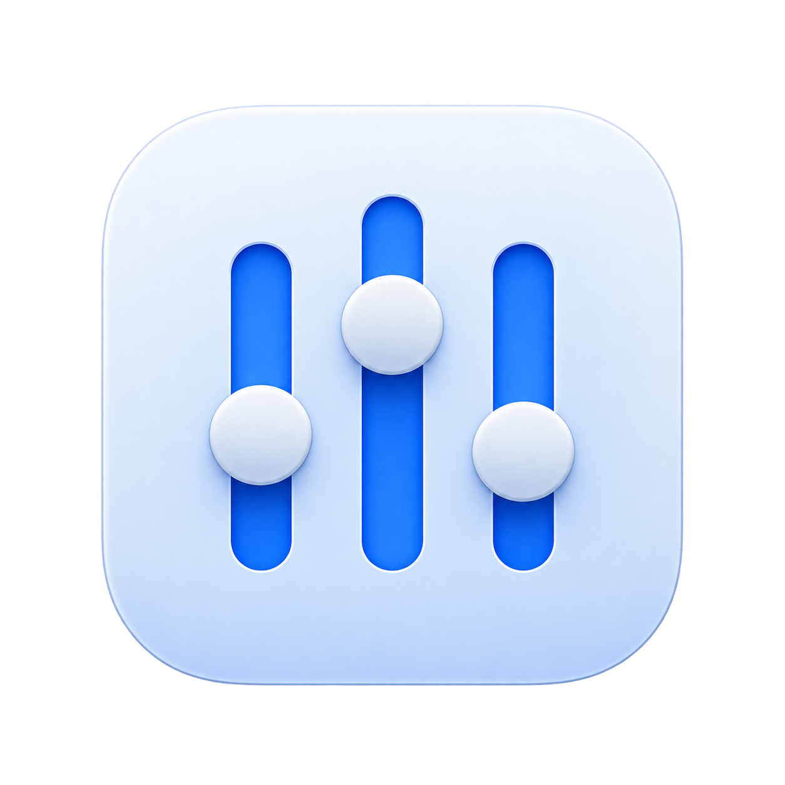
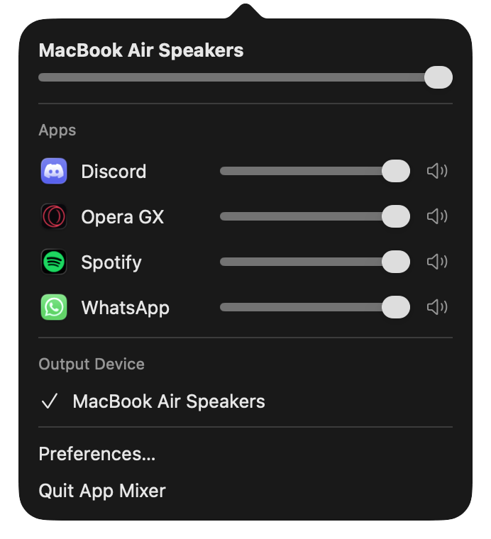
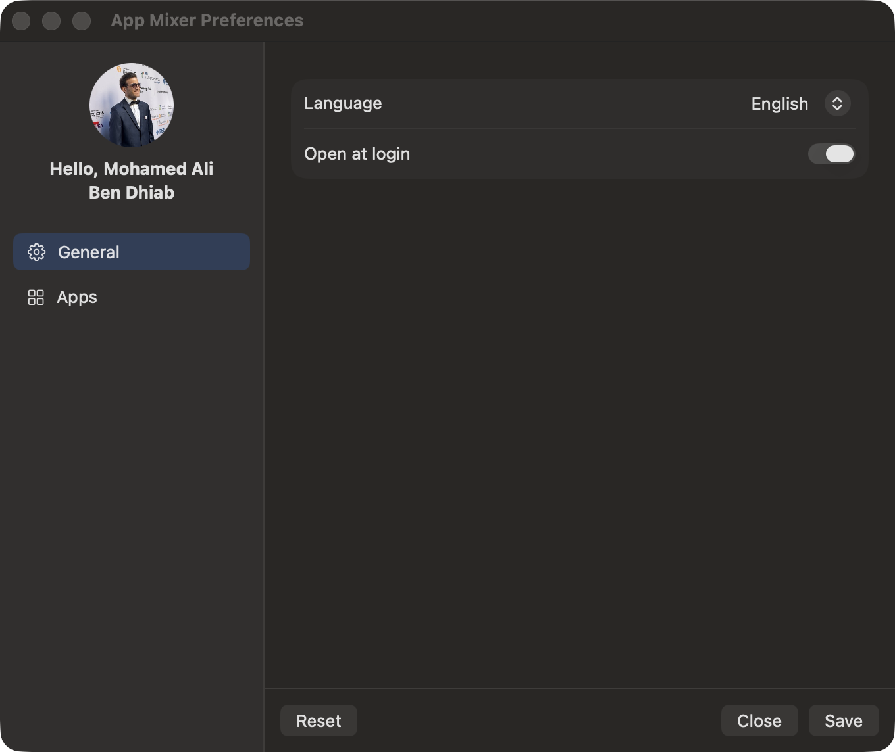
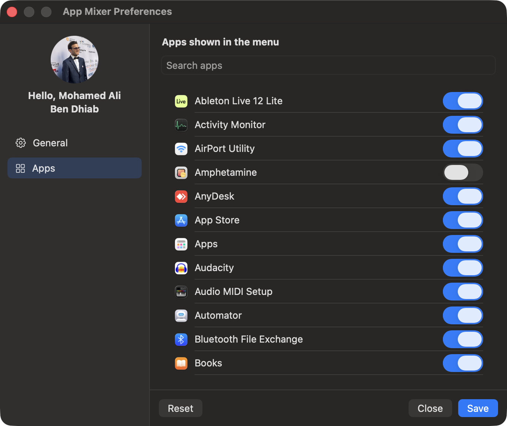

<p align="center">
  
</p>

<h1 align="center">AppMixer</h1>

<p align="center">
  <b>A per-app volume mixer for macOS, right in your menu bar.</b><br>
  Turn Discord down, keep Spotify loud, mute a noisy browser tab, and switch output devices, all from one place.
</p>

<p align="center">
  <a href="https://github.com/dalibendhiab10/AppMixer/releases/latest"></a>
  
  
  <a href="LICENSE"></a>
  <a href="https://paypal.me/bendhiab1"></a>
</p>

---

<p align="center">
  
</p>

## Features

- **Per-app volume**: a slider and mute button for every app that makes sound.
- **Master volume** with the name of the current output device.
- **Output device switcher**: pick speakers, headphones or AirPods without opening System Settings. Your per-app volumes keep working after a switch.
- **Playing indicator**: apps that are making sound right now are listed first with a green dot.
- **Choose which apps appear**: show or hide any app on your Mac from Preferences.
- **Remembers your settings** between launches, and can **open at login**.
- **Languages**: English, Français, العربية (with right-to-left layout).
- **Light on resources**: an app only has a tap while its volume is below 100%, so untouched apps run with no added latency.
- Lives in the menu bar only: no Dock icon, no window in your way.

## Preferences

<p align="center">
  
  
</p>

- **General**: language and *Open at login*.
- **Apps**: search every app on your Mac and toggle whether it appears in the menu.
- Changes are applied with **Save**, discarded with **Close**, and **Reset** restores the defaults.

## Install

1. Download `AppMixer-x.y.z.pkg` from the [latest release](https://github.com/dalibendhiab10/AppMixer/releases/latest).
2. Open it and follow the installer. AppMixer is installed in `/Applications`.
3. Launch **AppMixer**. Its icon appears in the menu bar.
4. The first time you lower an app's volume, macOS asks for permission to capture audio. Click **Allow**.

> **"AppMixer can't be opened because it is from an unidentified developer"**
> Release builds are not yet notarized by Apple. Right-click the installer (or the app) → **Open** → **Open**.
> Or remove the quarantine flag once:
> ```sh
> xattr -dr com.apple.quarantine /Applications/AppMixer.app
> ```

**Requirements:** macOS 14.2 (Sonoma) or later, Apple silicon or Intel.

## How it works

macOS has no built-in per-app volume. AppMixer uses the **Core Audio process tap** API (macOS 14.2+):

1. It lists the processes that use audio and groups helper processes under their parent app (for example all Chrome helpers become "Google Chrome").
2. When you lower an app's slider, it creates a *process tap* for that app that mutes its normal output.
3. A private aggregate device plays the captured audio to your output device, scaled by the gain you chose, with a short ramp to avoid clicks.
4. Move the slider back to 100% and the tap is removed.

No kernel extension, virtual audio driver or screen-recording permission is needed.

## Build from source

```sh
git clone https://github.com/dalibendhiab10/AppMixer.git
cd AppMixer
./build.sh
open AppMixer.app
```

Needs the Swift toolchain (Xcode or the Command Line Tools). To build the installer package:

```sh
scripts/make-pkg.sh 1.0.0      # → build/AppMixer-1.0.0.pkg
```

## Troubleshooting

| Problem | What to do |
|---|---|
| Menu bar icon doesn't appear | Check **System Settings → Menu Bar** and allow AppMixer. If the menu bar is full, items next to the notch can be hidden. |
| An app's slider does nothing | Make sure you allowed audio capture (**System Settings → Privacy & Security → Screen & System Audio Recording → System Audio Recording Only**), then restart the app. |
| AirPods are missing from the output list | macOS only exposes AirPods as an output after it routes audio to them (in your ears, or connected to this Mac). They appear as soon as they are active. |
| Output switches back after I change it | Some apps (Discord/Teams in a call, for example) ask macOS to route audio back to their preferred device. AppMixer re-applies your choice for a few seconds, but you can also change the device inside that app. |
| An app is not in the list | Only apps that have used audio appear. Start playing something in it. |

## Contributing

Contributions are welcome. See [CONTRIBUTING.md](CONTRIBUTING.md). Every push to `main` is released automatically, and the version is chosen from your [Conventional Commit](https://www.conventionalcommits.org/) messages.

## Support the project ❤️

AppMixer is free and open source. If it saves you from a surprise blast of volume, you can buy me a coffee:

<p align="center">
  <a href="https://paypal.me/bendhiab1">
    
  </a>
</p>

Starring the repo and sharing it helps too. ⭐

## License

[MIT](LICENSE) © 2026 Mohamed Ali Ben Dhiab
